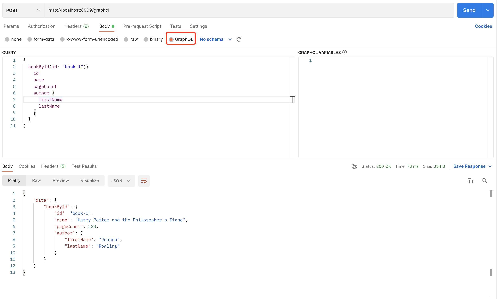

# postman发起请求



# curl发起请求
- 查询book
```shell

curl --location --request POST 'http://localhost:8909/graphql' \
--header 'Content-Type: application/json' \
--data-raw '{"query":"{bookById(id:\"book-2\"){id name pageCount author{firstName lastName} owner{owner_id name age}}}","variables":{}}'
```

- 查询owner
```shell
curl --location --request POST 'http://localhost:8909/graphql' \
--header 'Content-Type: application/json' \
--data-raw '{"query":"{ ownerById(owner_id:\"owner-1\"){ name  }}","variables":{}}'
```